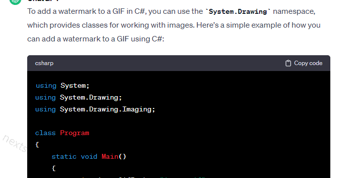
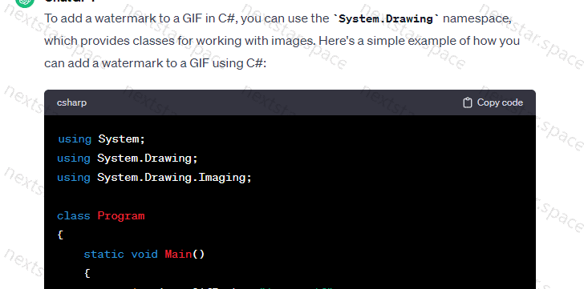

## Use package

### File read and save use

```csharp
var resource = "Resources";

{
    Console.WriteLine("watermark path");
    var subDir = "watermark_path/";
    Directory.CreateDirectory(subDir);

    var watermark = new Watermark("nextstar.space")
    {
        TextSize = 24
    };
    
    var inputPath = Path.Combine(resource, "chrome_zEjXw3YDnT.gif");

    var sw = new Stopwatch();
    sw.Start();
    // single gif
    watermark.Position = WatermarkPosition.BottomLeft;
    var outputSinglePath = Path.Combine(subDir, "chrome_zEjXw3YDnT_single.gif");
    watermark.Execute(inputPath, outputSinglePath);
    sw.Stop();
    Console.WriteLine(sw.Elapsed.ToString("c"));
    sw.Restart();
    
    // full gif
    watermark.Position = WatermarkPosition.Full;
    var outputFullPath = Path.Combine(subDir, "chrome_zEjXw3YDnT_full.gif");
    watermark.Execute(inputPath, outputFullPath);
    sw.Stop();
    Console.WriteLine(sw.Elapsed.ToString("c"));
    sw.Restart();
    
    
    var inputPath2 = Path.Combine(resource, "image2.png");

    // single png
    watermark.Position = WatermarkPosition.BottomLeft;
    var outputSinglePath2 = Path.Combine(subDir, "output_single.png");
    watermark.Execute(inputPath2, outputSinglePath2);
    sw.Stop();
    Console.WriteLine(sw.Elapsed.ToString("c"));
    sw.Restart();
    
    // full png
    watermark.Position = WatermarkPosition.Full;
    var outputFullPath2 = Path.Combine(subDir, "output_full.png");
    watermark.Execute(inputPath2, outputFullPath2);
    sw.Stop();
    Console.WriteLine(sw.Elapsed.ToString("c"));
    sw.Restart();
}
```

### File stream use

```csharp
var resource = "Resources";
{
    Console.WriteLine("watermark_stream use stream");
    var subDir = "watermark_stream/";
    Directory.CreateDirectory(subDir);

    var watermark = new Watermark();

    var inputPath = Path.Combine(resource, "chrome_zEjXw3YDnT.gif");


    var sw = new Stopwatch();
    sw.Start();
    // single gif
    using (var inputStream = File.OpenRead(inputPath))
    {
        watermark.Position = WatermarkPosition.BottomLeft;
        var outputSinglePath = Path.Combine(subDir, "chrome_zEjXw3YDnT_single.gif");
        inputStream.Seek(0, SeekOrigin.Begin);
        var outputSingleStream = watermark.Execute(inputStream, WatermarkImageFormat.Gif);
        using (var outputFile = File.Create(outputSinglePath))
        {
            outputSingleStream.CopyTo(outputFile);
        }
    }

    sw.Stop();
    Console.WriteLine(sw.Elapsed.ToString("c"));
    sw.Restart();

    // full gif
    using (var inputStream = File.OpenRead(inputPath))
    {
        watermark.Position = WatermarkPosition.Full;
        var outputFullPath = Path.Combine(subDir, "chrome_zEjXw3YDnT_full.gif");
        inputStream.Seek(0, SeekOrigin.Begin);
        var outputFullStream = watermark.Execute(inputStream, WatermarkImageFormat.Gif);
        using (var outputFile = File.Create(outputFullPath))
        {
            outputFullStream.CopyTo(outputFile);
        }
    }

    sw.Stop();
    Console.WriteLine(sw.Elapsed.ToString("c"));
    sw.Restart();


    var inputPath2 = Path.Combine(resource, "image2.png");

    // single png
    using (var inputStream = File.OpenRead(inputPath2))
    {
        watermark.Position = WatermarkPosition.BottomLeft;
        var outputSinglePath2 = Path.Combine(subDir, "output_single.png");
        inputStream.Seek(0, SeekOrigin.Begin);
        var outputSingleStream2 = watermark.Execute(inputStream, WatermarkImageFormat.Png);
        using (var outputFile = File.Create(outputSinglePath2))
        {
            outputSingleStream2.CopyTo(outputFile);
        }
    }

    sw.Stop();
    Console.WriteLine(sw.Elapsed.ToString("c"));
    sw.Restart();

    // full png
    using (var inputStream = File.OpenRead(inputPath2))
    {
        watermark.Position = WatermarkPosition.Full;
        var outputFullPath2 = Path.Combine(subDir, "output_full.png");
        inputStream.Seek(0, SeekOrigin.Begin);
        var outputFullStream2 = watermark.Execute(inputStream, WatermarkImageFormat.Png);
        using (var outputFile = File.Create(outputFullPath2))
        {
            outputFullStream2.CopyTo(outputFile);
        }
    }

    sw.Stop();
    Console.WriteLine(sw.Elapsed.ToString("c"));
    sw.Restart();
}
```

### Result

#### GIF Image





#### Normal Image


